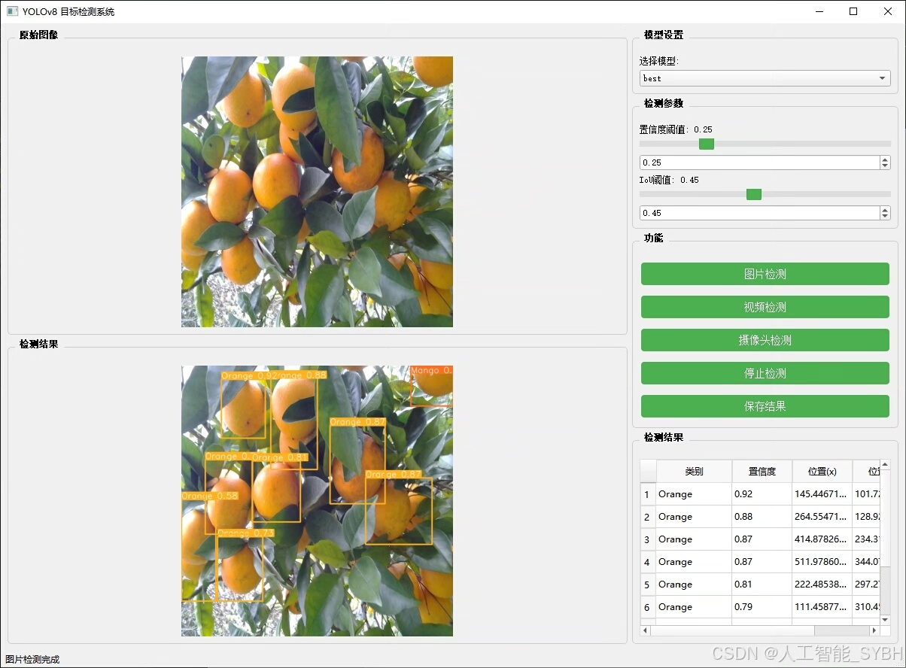
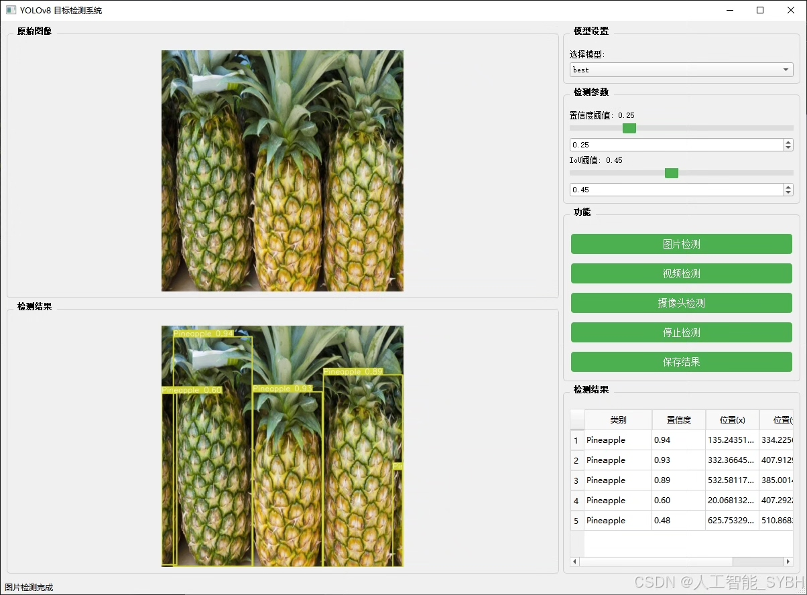
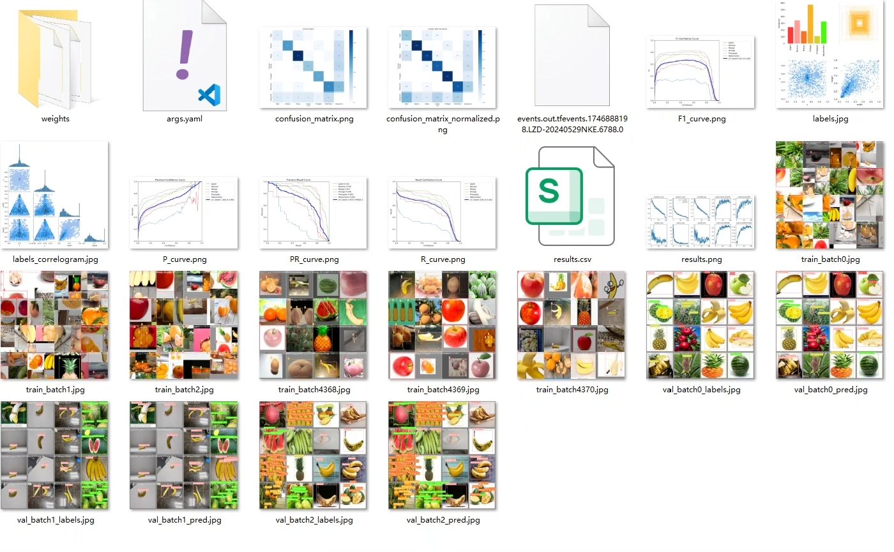
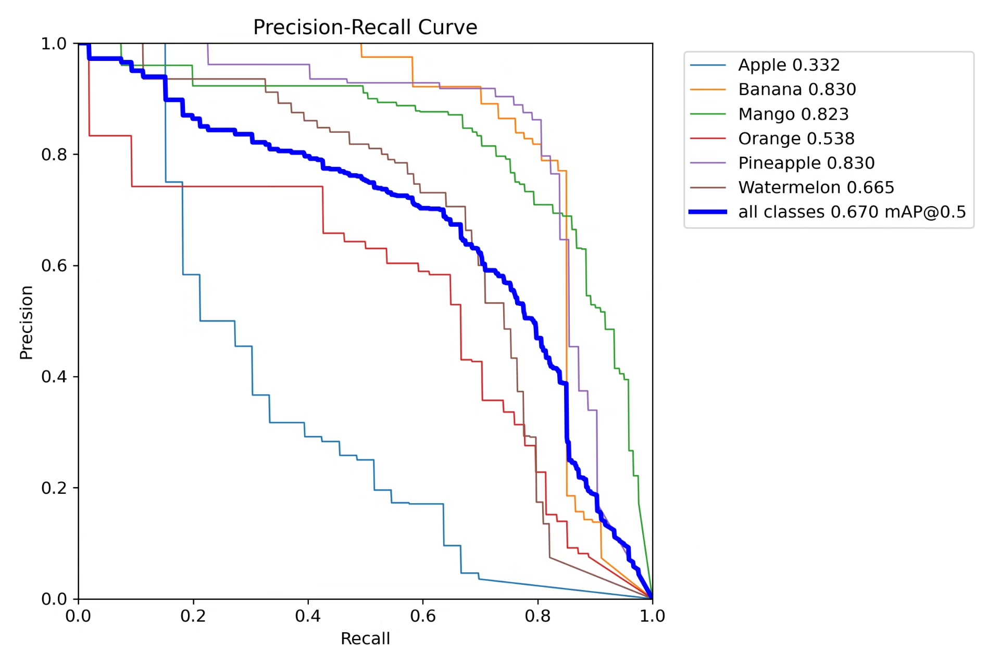
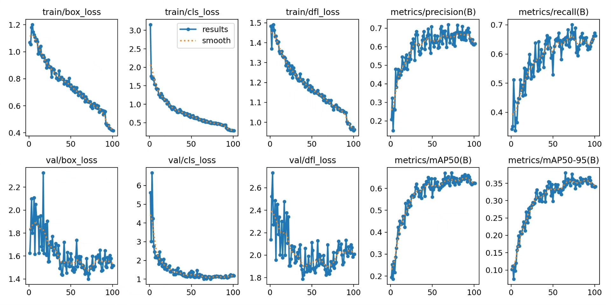
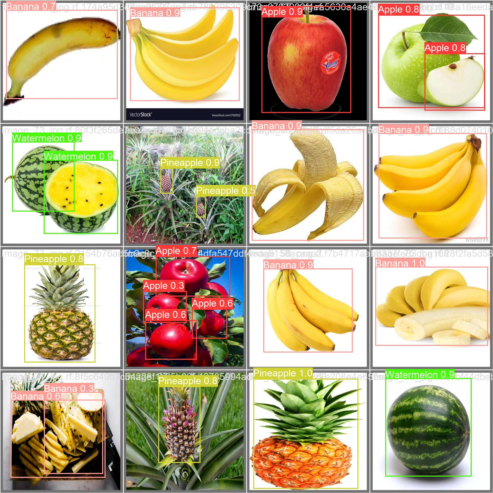
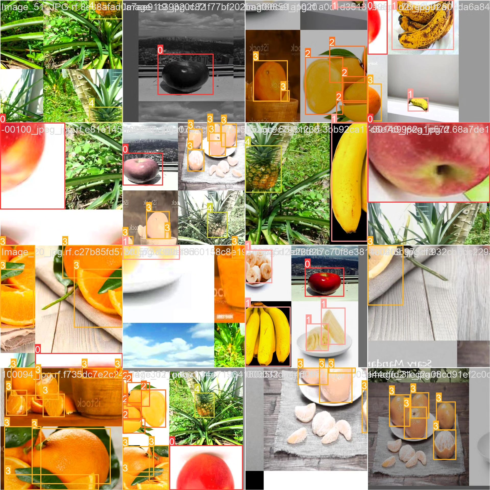

# Fruit classification detection system based on deep learning YOLOv8+Y

## Body

This project is based on the YOLOv8 object detection algorithm, developing a high-efficiency and precise automatic fruit classification detection system. It can identify and classify six common fruits in real time: Apple (Apple), Banana (Banana), Mango (Mango), Orange (Orange), Pineapple (Pineapple), and Watermelon (Watermelon) (nc=6). The system utilizes deep learning technology, training and optimizing on its own dataset, which contains 1007 labeled images, including 768 training images, 129 validation images, and 110 test images, ensuring that the model has good generalization ability and robustness.

The company's products have obtained the official commercial license certification of YOLO.

We provide after-sales service.

After payment, we will provide WeChat ID for any questions.

Environment configuration: We will provide an environment configuration tutorial, and WeChat will provide answers to questions.

Remote installation service: If you need remote configuration, an additional fee of 69 is required, with all fees refunded if the configuration fails (only refunding installation fees for old computers).

Retraining dataset: After configuring the environment, you can train on your own computer. If you need us to retrain, just pay 69 plus computing power fees (2.5 yuan/hour).

Full after-sales service

## Images

## Payment

Here is a pay link on Stripe ( https://buy.stripe.com/3cs8yP7sY87d0vu9AB ). Please contact me lonlonago@foxmail.com after funding $89, and I will send you a complete data files , thank you!

